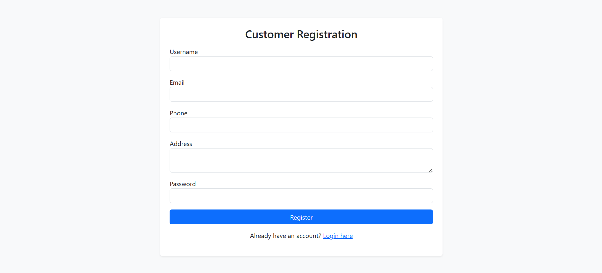
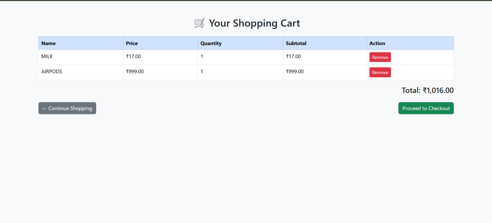
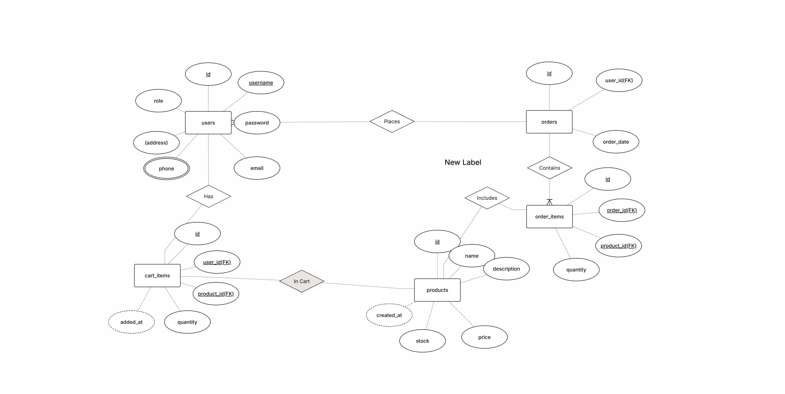

# E-commerce-Inventory-System

I made this project as part of my University Project Curriculum. This project is fully focused on Database Management and hence you will not find any fancy UI/UX in the Frontend.

<h2>*****FrontEnd*****</h2>

Frontend of this platform is made using HTML and CSS. PHP was used to dynamically create some of the frontend elements by taking data from the database created by the user.The simple UI of the platform is very smooth and easy to use

<h3>LoginPage</h3>

 

<h3>CustomerRegister</h3>

 

<h3>AdminDashboard</h3>

 

<h3>ProductList</h3>

 

<h3>CustomerDashboard</h3>

 

<h3>CustomerCart</h3>

 

<h2>*****Key Features*****</h2>

<ul>
<li>Secure authentication and Registration.
<li>Adding wide range of Products.
<li>Product cart to verify items before checkout.
<li>Separate window for Admin and Customers.
<li>Managing and Viewing Orders or Products.
</ul>

<h2>*****BackEnd*****</h2>

Backend part is executed using PHP, XAMPP and MYSQL. XAMPP provides Apache and MySQL servers for hosting and running database respectively. XAMPP is using MariaDB for storing databases. Some of the tables and queries were executed on MYSQL Workbench.

<h3>ERDiagram</h3>

 

<h4>See below for Project Report</h4>

[Report](<Ecommerce-Management Report.pdf>)
 

<h2>*****How to run locally at your PC*****</h2>
<ul>
<li>First of all Fork the repo.
<li>Clone the repository in your local computer inside a folder/directory.
<li>Download XAMPP from here - https://www.apachefriends.org/download.html
<li>Find the downloaded xampp folder.
<li>Move the directory to xampp -> htdocs.
<li>Search for XAMPP Control Panel and open it.
<li>Start Apache and MYSQL. Wait for the green signal.
<li>Now open your phpmyadmin page using this - http://localhost/phpmyadmin/
<li>Open your E-commerce Inventory Page using - http://localhost/(your-folder-name)/
<li>That's all folks. Now Enjoy using the platform.
</ul>

If you liked this share with all your loved ones.
