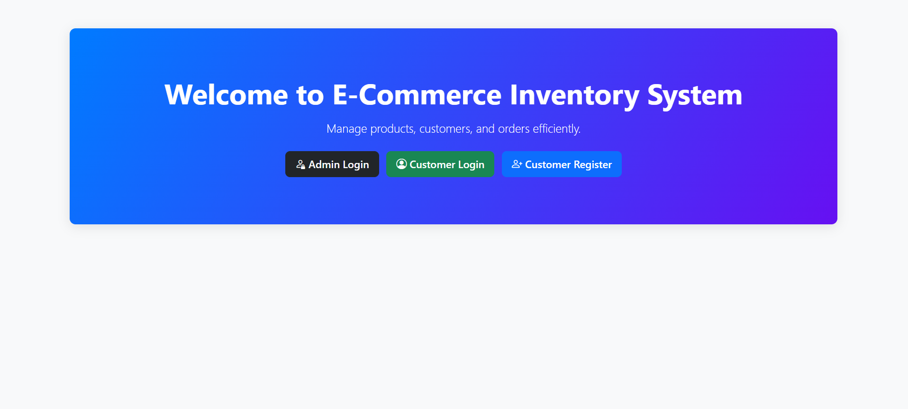
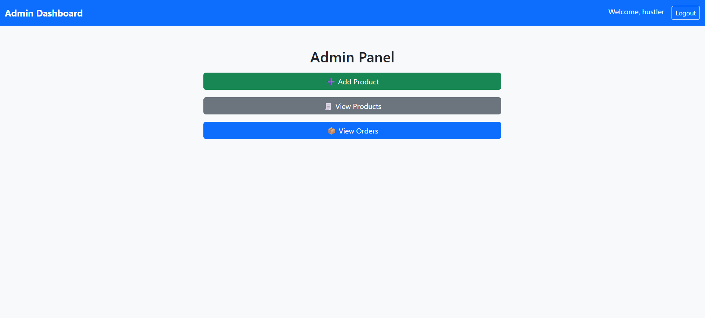
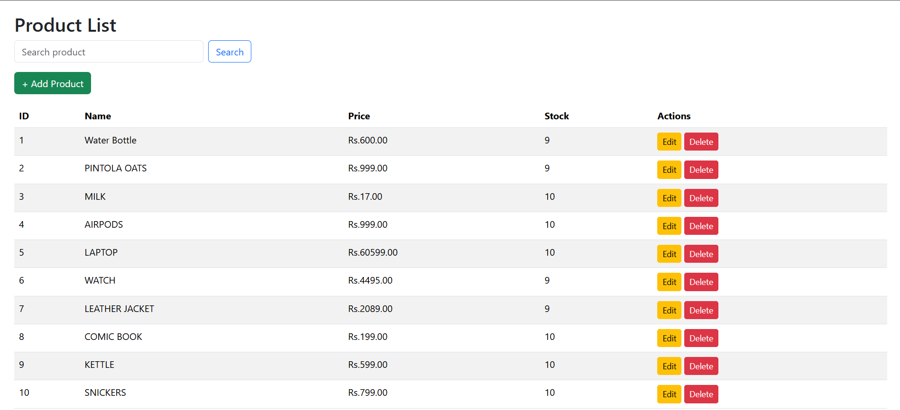
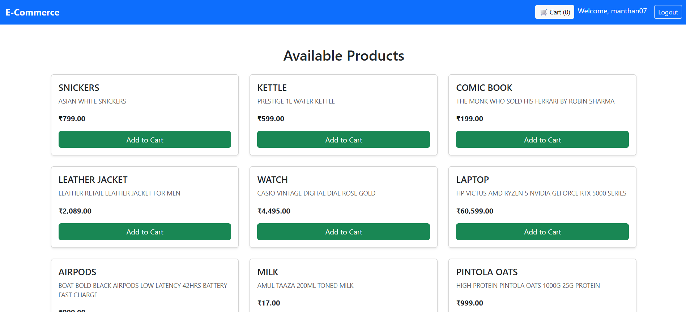

# E-commerce-Inventory-System

I made this project as part of my University Project Curriculum. This project is fully focused on Database Management Part and hence you will not find any fancy UI/UX in the Frontend.

<h2>*****FrontEnd*****</h2>

Frontend of this platform is made using HTML and CSS. PHP was used to dynamically create some of the frontend elements by taking data from the database created by the user.The simple UI of the platform is very smooth and easy to use

<h3>LoginPage</h3>

 

<h3>AdminDashboard</h3>

 

<h3>ProductList</h3>

 

<h3>CustomerDashboard</h3>

 

